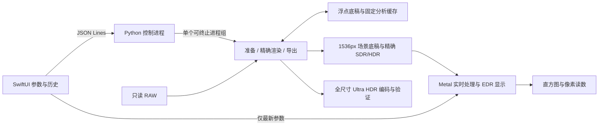

# Img2UltraHDR 0.3 本机 macOS 应用

本机版使用 SwiftUI/AppKit 界面、Metal 实时预览和现有 Python 精确图像引擎。英文简明说明见 [English guide](macos-app-en.md)。支持 Apple Silicon、macOS 15 及以上；当前实际验收机器为 16 GB MacBook Pro、macOS 26.7.1。应用不会上传照片，不需要 Apple 开发者会员。它依赖构建时记录的本机环境，不是可分发的独立安装包。

## 打开与使用

当前为 **0.3.0（build 1）**，0.2.0 为初始版本，统一安装在 `~/Applications/Img2UltraHDR.app`，从 Finder 或 Spotlight 打开。主窗口标题、底部状态栏及设置显示版本号；设置和“关于”同时显示构建号。构建脚本直接更新这个安装位置，不再在 `dist/` 中保留应用副本。**项目和 `.venv` 仍需要保留在构建时的位置**。第一次启动请允许系统访问“文稿”文件夹；本项目的引擎和示例 RAW 位于该目录。拒绝后可在系统设置的“隐私与安全性 → 文件与文件夹”中修改。应用的“帮助 → Img2UltraHDR 使用说明”提供同样说明。

1. 拖入一张 Canon CR2 或 Fujifilm RAF，也可点“打开”。首次显影需要等待；一次拖入多张会明确提示。
2. 默认使用冻结的 Phone Clear V8 R5，可切换 Phone Natural V8。切换保留相对调整量。
3. 调整曝光、高光、阴影、白色色阶、黑色色阶、饱和度或 HDR 强度。拖动时 GPU 立即更新浮点图像，松开后后台精确校正；数字输入停止约 250 ms 后提交。状态会区分实时、正在精确更新和精确预览。精确任务运行时可以继续调整，新输入会取消过期任务。
4. 白平衡支持自动、相机和自定义。首次自定义从 5600 K / 居中色调开始，之后保留自定义值。连续切换模式时合并 250 ms 内的选择，只处理最后一个模式。已完成的精确预览可即时复用（最多记住 8 组参数）；首次模式切换仍需要精确显影，相同的中间显影按原片、引擎和参数复用；自定义底稿就绪后，色温、色调拖动提供近似反馈，松开后重新显影。自动模式不虚构色温。实时白平衡与精确结果可能存在颜色校正，尤其是大幅改变参数时。
5. HDR/SDR 切换只改变显示。初始效果是当前风格默认处理；“适应窗口”显示全图，“100% 检查”按需生成原尺寸图像并按物理像素显示，可滚动、拖拽和平移，触控板捏合缩放。
6. 齿轮或 `⌘,` 打开设置：中文 / English、浅色 / 深色 / 跟随系统。切换立即生效，重启保留，不改变照片配方或撤销历史。
7. 直方图可选亮度或 RGB；鼠标移到照片上显示像素读数。两端三角形或 `J` 开关输出边界提示。
8. 导出 Ultra HDR JPEG。可以额外保存 SDR、移除拍摄元数据。导出期间锁定调整，保留取消入口；完成后在 Finder 显示成品。

双击参数名称可只重置这一项，重置可撤销。Edit 菜单保留撤销、重做、剪切、拷贝、粘贴；数值输入和可选择的技术日志仍使用系统文本编辑。

白色色阶、黑色色阶范围 −100～100，对应内部 ±2 EV 的亮度权重增益；白色色阶优先影响最亮区域，黑色色阶优先影响亮度低于 0.045 的深暗部。两者默认为零，纯黑仍为黑色，不把 SDR 白当作 HDR 的输出上限。具体公式和验收见 [0.3 验收记录](macos-app-v03-validation.md)。

曝光是自动起点之上的 ±3 EV；高光、阴影为 ±2 EV；饱和度 100% 保持自动结果，允许 80–120%；HDR 强度 100% 为当前配方完整强度；“更多”中的 SDR 亮度为 ±2 EV。峰值固定 1000 nit，不通过屏幕亮度改变导出配方。支持 100 步内撤销、重做以及当前风格重置。

调整随照片内容指纹保存，重开相同原片即可恢复；重新启动还会恢复上次照片。原片移动后可重新定位，应用会验证文件内容；原片被修改后需要作为新照片重新打开。缓存丢失只会触发重新计算。源代码或依赖变化后提示引擎更新并使缓存失效。

## 本地数据与故障恢复

| 内容 | 位置 |
| --- | --- |
| 浮点底稿、预览与全尺寸缓存 | `~/Library/Caches/Img2UltraHDR` |
| 调整、未完成渲染的参数草稿、导出记录 | `~/Library/Application Support/Img2UltraHDR` |
| 后台日志 | `~/Library/Logs/Img2UltraHDR/engine.log` |
| 本机依赖位置 | `.app/Contents/Resources/engine.json` |

缓存默认上限 10 GB，清理旧会话时保留当前任务依赖；大型处理中临时占用可以超过该上限。可关闭应用后删除缓存来释放空间，保留 Application Support 即保留调整。处理不会修改原始 RAW。任务取消后只清理自身临时文件，不清理原片、历史样张和导出成品。磁盘不足在昂贵计算前报错；后台异常时可重试，参数草稿已经保存。

自用版依赖项目的 `.venv/bin/python`、RawTherapee、libultrahdr 和 ExifTool。启动先检查路径；首次或依赖版本变化时运行编解码检查。若移动/删除依赖，按项目 README 恢复环境再运行构建脚本。无需手动配置 Finder 的 PATH。

HDR 的实际亮感由屏幕、系统亮度和显示余量决定。应用显示当前余量，普通显示条件下由系统适配。HDR 强度为零或场景没有强高光时，文件仍可以是有效 Ultra HDR。普通截图只能检查布局和 SDR 外观，不能替代 HDR 实屏观看。

## 构建

```bash
# 按项目 README 安装依赖并建立 .venv 后：
scripts/build_macos_app.sh
open ~/Applications/Img2UltraHDR.app
```

构建前请先退出应用。脚本构建 Swift 可执行文件、Vision 辅助程序、数值加速库，复制 Metal 与双语资源，写入绝对依赖位置、Info.plist 和本地签名，并验证签名。临时应用在隐藏的构建目录中生成，验证后替换唯一安装位置，失败时保留原应用。需要自定义位置时可传入一个 `.app` 路径参数。应用版本及构建号统一维护在 `macos/Sources/Img2UltraHDR/Resources/AppVersion.json`，Info.plist 和界面读取同一份信息。不需要完整 Xcode；本机 Command Line Tools 的默认 SwiftPM 构建后端不能解析配置，因此脚本显式选择仍可用的 `--build-system native`。该选项在当前 Swift 版本提示弃用，未来工具链可能需要调整。Release 构建禁用不参与运行的调试符号生成，以避免本机 dsymutil 的目录扫描停滞。

编译后的 Vision helper 随应用提供，CLI 保留原来的动态编译回退。C 加速库只由应用环境启用；CLI 默认保留 NumPy 路径。矩阵舍入、色域压缩和图像边缘约束的加速均有与参考实现逐像素一致的测试。没有改变冻结配方。

## 架构与接口



- `pipeline.prepare_raw_scene` 提取原 CLI 的 RAW 显影阶段；`render_raw` 仍调用同一实现。
- `editor.EditRecipe` 保存应用参数；`EditorStore.prepare/render/export` 负责会话与缓存。固定完整画面的自动统计、场景判断和人物分析，不以局部视口重新测光。
- `render_pair` 接收独立的 `edit_exposure_ev`、`shadow_ev`、`white_ev`、`black_ev`、`saturation_scale` 和固定分析，通过独立的 `RenderPolicy` 保留自动保护策略；旧 CLI 的参数来源只在兼容适配处转换为策略。应用曝光不会触发旧 CLI 手动正曝光的额外高光奖励。色调映射为 `Green = 2^(tint/100)`，这是保存记录和协议中的引擎值。0.2 界面采用其反号，使滑块左侧偏绿、右侧偏洋红；旧记录数值和成片不改变。方向用 CR2 / RAF 的实际重新显影结果校准，不能把光源乘数直接当作图像增益。[RawTherapee 的光源乘数定义](https://github.com/RawTherapee/RawTherapee/blob/5.13/rtengine/colortemp.cc#L4136)。
- 阴影在线性曝光之后、影调映射之前应用 `2^(shadowEV × max(1 − Y/0.18, 0)^2)`，RGB 共用增益。零调整跳过处理。
- 普通预览最长边 1536，来自浮点底稿的 BOX 缩小；全尺寸检查使用完整画面。两个路径共用影调、肤色、人物和边缘约束，不使用上一张 JPEG 继续编辑。应用的小尺寸预览最多使用 4 个独立行块并行处理，结果仍按原行顺序汇总。Clear 使用 256 行块改善任务分配；Natural 保留原 512 行块，避免改变半浮点舍入边界。全尺寸主图保持串行分块，限制峰值内存。
- 全尺寸缓存保留编码用半浮点 HDR 数据。只改变拍摄元数据选项时，复用同一像素重新编码，避免再渲染或用已损失的 JPEG 还原像素。
- 缓存键包含原片 SHA-256、配方、显影设置、源码、工具路径/文件版本信息、Python 包版本和预编译 helper 身份。白平衡使相关底稿失效；曝光等调整复用底稿。

协议请求带 `command/id/session_id/revision`，照片请求再带 `source/recipe/expected_sha`。命令为 `hello/prepare/preview/full_render/export/cancel/close`；事件为 `progress/opened/result/cancelled/error`。`prepare` 完成准备后同时返回第一张预览。`recipe: null` 表示恢复保存的调整。`export` 还接受 `destination/include_sdr/strip_metadata/overwrite`。标准输出仅承载 JSONL，日志写标准错误和本地日志文件。

控制器为重任务启动单独的进程组，新的重请求先取消旧任务；SIGTERM 等待最多 2 秒，再清理本任务进程组。控制器拥有每个子任务的临时目录，处理强制终止后的清理；计算子进程检测控制器死亡并结束自身进程组。系统已回收的僵尸进程组单独处理，不会因此让控制器退出。发布 JPEG 前先完成编码、解码和元数据检查，复制到目标目录临时文件，短时间内替换最终文件；普通提交失败会恢复原文件。不能承诺断电时两个不同文件的跨文件事务原子性。

### 浮点、实时预览与显示

协议版本为 2；`hello` 返回 `float_preview_v1` 能力。应用给预览请求添加 `preview_format: "float_v1"`。像素通过原子发布的不可变缓存文件传递，JSON 只含描述和分析资料。旧协议客户端不发送该字段时仍获得 JPEG 预览。导出与 CLI 参数语义不变。

每份包包括 1536 像素场景底稿、精确 SDR/HDR RGBA16FloatLE 帧、尺寸与步幅、色彩空间、203 nit 参考白、1000 nit 峰值、锚点配方及完整场景的 1025 个亮度分位点。原生端检查格式和算法版本；当前帧的缓存由进程租约保护。GPU 只保留当前照片的少量纹理，不累积历史帧。待加载请求会合并，重绘在空闲时停止。

实时路径从场景底稿重新计算曝光、高光、阴影、分位统计和全局影调，并保留最近精确结果中的肤色、颜色、人物和边缘处理残差。Clear 随曝光变化的全局背景影调也实时更新。白平衡使用相对 Bradford 色适应；色调在与引擎光源定义对应的线性 sRGB 基底换算，再转回 Rec.2020。实时处理是近似路径，精确任务完成后重新建立依据，正式导出不使用该近似结果。

精确浮点帧直接截取自现有渲染器，不做 Ultra HDR 编码往返。Clear 在最终 8 位量化前截取；Natural 的冻结流程本来在人物处理前量化，0.2 保留其接受过的 pre-JPEG 数值，不以新增浮点输出为由改变默认配方。内部用于人物分析的参考 JPEG 仍按原流程生成。

Clear 内部独立的 SDR 分析参考只计算实际需要的 SDR 数据，省去原来生成后无人读取的 HDR 副本；正式 HDR 和人物、肤色、高光、边缘保护照常执行。这一分支有 SDR 浮点及 JPEG 等价检查，最终渲染另有冻结结果对照。

显示使用 `MTKView`、`rgba16Float`、线性 Rec.2020（HDR）或线性 Display P3（SDR），给 EDR 图层设置 203 nit 光学刻度与 1000 nit 内容峰值。HDR 能力判断使用屏幕的潜在余量，避免“启用 EDR 前当前余量为 1”造成永远不能启动 HDR。界面另外报告当前可用余量。SDR 屏幕显示配套 SDR 图像；屏幕变化不修改导出内容。全尺寸与实际导出文件由 Core Image 解码，按显示出来的文件统计。

GPU 初始化或运行失败会回退精确预览，并明确提示实时加速、直方图和取色不可用，避免保留过期读数。兼容显示路径沿用 Core Image / 原生 EDR 图层。Metal 源码随应用资源提供，在后台运行时编译，无需完整 Xcode。

### 直方图、取色与边界提示

- 统计完整图像，不受缩放、平移影响；初始效果、HDR/SDR、全尺寸、实际导出文件分别使用对应帧。拖动时直方图和文字读数最多约 10 Hz，停止后刷新最终帧；图像更新独立调度，不等待文字布局。
- SDR 横轴为 Display P3 的 0–255 编码值。HDR 左侧保留黑位至 SDR 白，右侧为 EV，标出 +1、+2 EV 和 +2.30 EV / 1000 nit 上限。橙线表示当前屏幕范围。
- 蓝色提示：SDR 所有通道编码值 ≤0.5；HDR 线性亮度 ≤0.00001。红色提示：SDR 任一通道 ≥254.5；HDR 任一通道 ≥1000/203 的 99.9%。超过 SDR 白属于正常 HDR，不自动标红。
- RGB：SDR 为 Display P3 0–255；HDR 为线性 Rec.2020 百分比，可以超过 100%。HDR 亮度给出相对 SDR 白的 EV 及数值乘 203 得到的参考 nit，不声称测量了屏幕实际亮度。
- 鼠标离开照片显示横线；覆盖层不参与直方图、取色或导出。这些提示不是 RAW 传感器过曝检测。

## 验证入口

```bash
.venv/bin/python -m pytest -q
# 原生模型测试不依赖 Command Line Tools 未附带的 XCTest：
swiftc -O -D EDITOR_MODEL_CHECK macos/Sources/Img2UltraHDR/*.swift \
  scripts/check_macos_editor.swift -o /tmp/check-editor
HDRIMG_RESOURCES="$PWD/macos/Sources/Img2UltraHDR/Resources" \
  /tmp/check-editor /tmp/img2uhdr-native-checks
```

`scripts/validate_macos_editor.py` 支持冻结版本对照和 37 RAW 全尺寸回归；后者依赖本机未入库的 `pics/`。`compare_editor_previews.py` 比较解码后的 HDR 预览/成片；`validate_editor_cancellation.py` 在三个真实处理阶段取消任务；`monitor_editor_memory.py` 记录指定验证进程树的 RSS。验证输出写入新的目录，不覆盖历史证据。测试结果和未通过/待人工项目见 [0.2 验收记录](macos-app-v02-validation.md)。冻结对照需要显式传入 `--baseline`；准备缓存通过相关脚本的 `--prepared-cache` 或 `--cache` 参数指定，不依赖旧版本目录。

0.2 增加 `check_interactive_preview.swift` 与 `compare_interactive_previews.py` 的同输入 GPU / 精确像素对照，`check_preview_tools.swift` 的合成图统计、坐标及边界检查，以及 `check_preview_window.swift` 的真实 drawable 呈现时间与 GPU 内存记录。窗口不可见时呈现时间为零，不能算作延迟通过。所有脚本只对本次独立输出目录写入；不要让性能基准与其他重处理并发。应用的 `--diagnostics` 流程使用独立缓存和编辑记录，避免修改日常编辑状态。

`benchmark_editor_worker.py` 测量实际 JSONL 请求至结果就绪，包括原片指纹、子进程启动及精确渲染；它使用已准备的六场景浮点输入，不重新显影。输入底稿的原引擎版本和测试所用版本均写入报告。实际应用的 `--preview-benchmark <cases.json> --diagnostics <新目录> --benchmark-seconds 35` 计量模型参数变化至 drawable 呈现；不将提交 GPU 的时间或不可见窗口算作显示性能。

按用户要求，旧版应用、恢复副本、0.1 本机验证输出与工作区备份已清理。0.2 的验收报告和成片、原始 RAW、已保存的照片调整继续保留。可再生的运行缓存也已清理，首次重开照片需要重新准备底稿。源码历史由 Git 保存。
